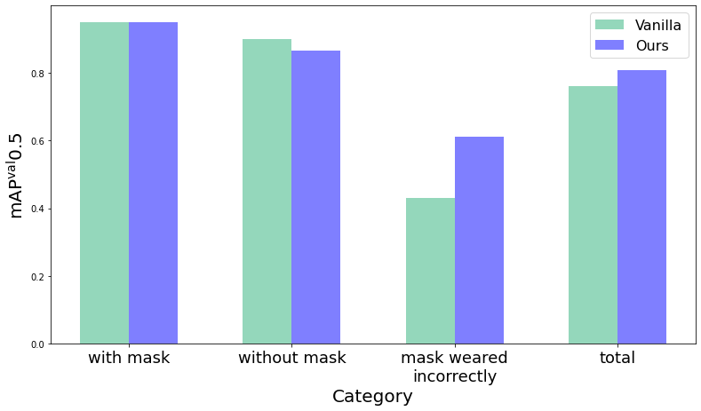
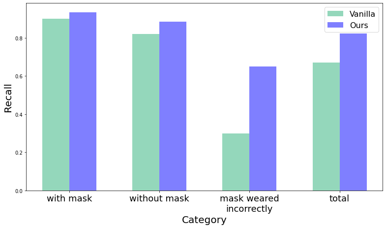
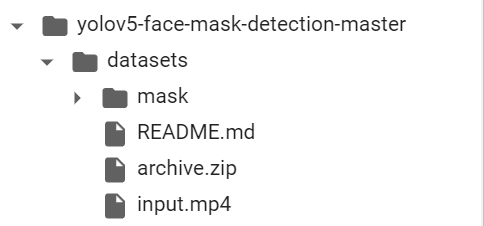
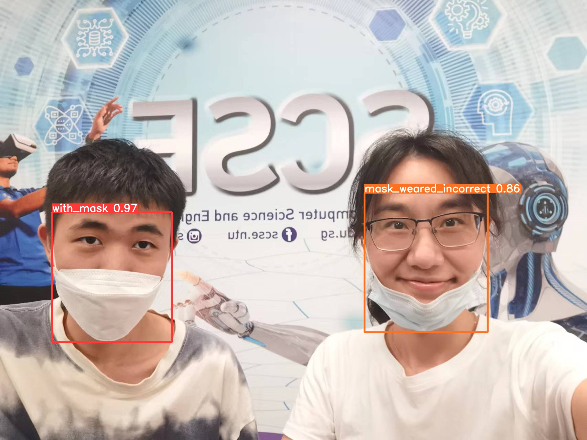
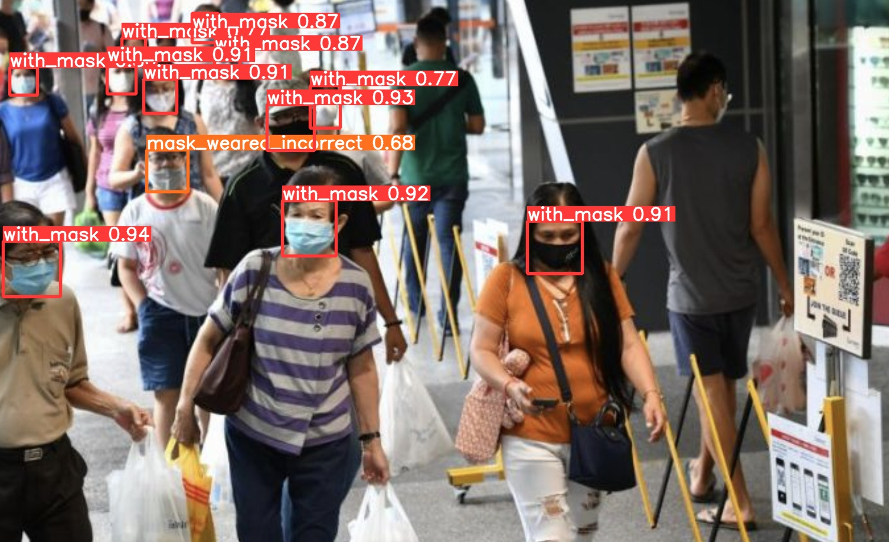
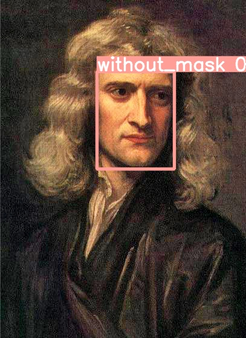

# ML Project: A face mask detector
Team member: Peng Tianyi, Wang Shuai, Ye Huanyi
Based on 853 pictures and three classes (wear mask, no mask, wear mask incorrectly), we improved and trained the face mask detector based on YOLOv5s. 

## Performance
We get `80.9 mAP0.5` in the validation dataset with more than `100FPS` in `Tesla P100-PCIE-16GB`. 

### The performance of our model
| Class | #Labels | Precision | Recall | mAP<sup>val<br>0.5 | mAP<sup>val<br>0.5:0.95 |
| :-: | :-: | :-: | :-: | :-: | :-: |
| `with mask` | 630 | 0.828 | 0.935 | 0.951 | 0.647 |
| `without mask` | 104 | 0.632 | 0.885 |  0.865 |  0.558 |
| `mask weared incorrectly` | 20 | 0.72 | 0.65 | 0.612 | 0.372 |
| `total` | 754 | 0.727 | 0.823 | 0.809 | 0.526 |

### The improvement of our model
<p align="center">
  
  
</p>  
  
## Prepare
### Download data
* Down load data from [my drive](https://drive.google.com/drive/folders/1Npgkvz3keXpVjxguD8YYr_BYqyyvaVBW?usp=sharing) 
* Unzip the file in `root`, replace `datasets` directory via unzip file
* Format like this 
<p align="center">
  
</p>

### Environment
* We strongly recommend you to run in `Google Colab` or other Linux system.
* Install necessary part
```
pip install -r requirements.txt
```

## Run!
### Inference
* Open `demo.ipynb`
* Set path
* Run the cells
### Validation
* Just continue running the cells
### Train
* Please use GPU and run the cell
* If you want to freeze, please train with freeze firstly, then train without freeze based on former weights.

## Effect show
<p align="center">
  
</p>
<p align="center">
  
</p>
<p align="center">
  
</p>


## Reference
https://github.com/ultralytics/yolov5  
https://github.com/spacewalk01/yolov5-face-mask-detection
