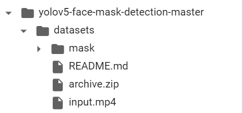

# ML_project

### download data
* down load data from [my drive](https://drive.google.com/drive/folders/1Npgkvz3keXpVjxguD8YYr_BYqyyvaVBW?usp=sharing) 
* unzip the file in `root`, replace `datasets` directory via unzip file
* format like this 

  

